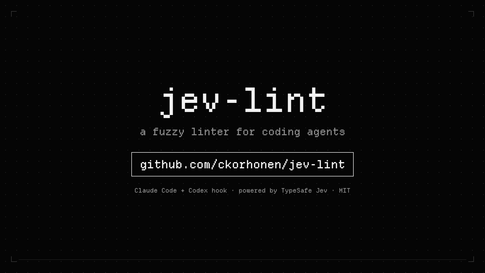

# jev-lint

**A fuzzy linter for coding agents.** Your agent writes a file; 0.3 seconds later it hears
which of your team's rules it just broke, and fixes them before anyone reviews the code.

[](docs/media/jev-lint-demo-1920x1080.mp4)

▶ **[Watch the 40-second demo](docs/media/jev-lint-demo-1920x1080.mp4)** (with sound; [square cut](docs/media/jev-lint-demo-1080x1080.mp4)). The editor scene is an illustrative session; the numbers are from the notebook.

🌐 **Website:** [jevlint.dev](https://jevlint.dev) · 📓 **Results and method:** [experiment notebook](https://claude.ai/artifact/BUZG9LEnaiJyaJuaP7tajs)
(source in `report/`).

## Contents

- [Why use it](#why-use-it)
- [Set it up with your agent](#set-it-up-with-your-agent)
- [How it works](#how-it-works)
- [What's in the box](#whats-in-the-box)
- [Results](#results)
- [Reference](#reference)
  - [Install](#install)
  - [Generate rules for your repo](#generate-rules-for-your-repo)
  - [Learn from what it catches](#learn-from-what-it-catches)
  - [Rule packs](#rule-packs)
    - [Options (environment variables on the hook command)](#options-environment-variables-on-the-hook-command)
  - [Local models](#local-models)
  - [Evaluation harness](#evaluation-harness)
  - [For agents working in this repo](#for-agents-working-in-this-repo)
  - [Development](#development)
  - [Contributing](#contributing)
  - [License and credits](#license-and-credits)

Also: [pack docs](docs/packs/) · [feedback loop](docs/feedback-loop.md) · [experiment notebook](https://claude.ai/artifact/BUZG9LEnaiJyaJuaP7tajs)

## Why use it

- **Catches what linters can't.** "Don't derive state in `useEffect`", "a test must be able
  to fail", "never trust a client-sent `userId`": rules that need judgment, not a regex.
  Normally they surface at code review. jev-lint flags them the moment the file is written.
- **Agents ship fewer violations.** In real runs with the hook on, rule violations per task
  fell from 2.38 to 1.21 in Claude Code (96 runs) and from 1.67 to 0.92 in Codex (48 runs).
- **Fixing at the edit is cheaper than fixing after review.** The agent fixes the problem
  while the file is still open: about +$0.04 and a few seconds per task. Found in review
  instead, the same problem costs a review → fix → re-review round, about $0.18 and 70 s on
  our agent runs, on top of the review itself. With the hook on, review comments covered by
  our rules fell 41%.
- **Costs almost nothing to run.** About $1.51 per 10,000 edits for the checks. It never
  blocks the agent: if anything fails, the edit goes through unchanged.
- **Starts with opinionated defaults.** Tested rule packs for TypeScript and React, Swift and
  SwiftUI, Kotlin, Rust, Python, Ruby and Bazel, plus cross-language packs for security,
  test hygiene (tests that can't fail, flaky tests) and performance (170 rules). Every
  rule passed an evaluation on held-out examples before it was switched on. See
  [the pack docs](docs/packs/) for a good and bad example of each.
- **Your rules, not just ours.** The packs are only defaults: turn any pack or rule off, scope
  it to some folders, or add your own rules for your team and codebase in `.jev-lint/`. One
  skill reads your agent instructions, docs, skills and linter configs, researches current
  best practices for your frameworks, and proposes rules for you to approve (nothing a linter
  already checks). Another writes and tests a single rule when you think of one.
- **Gets better over time** ([how](docs/feedback-loop.md)). Every check is logged. The learning skill finds the mistakes agents
  keep making, proposes a few targeted fixes to your instructions or rules, and measures
  whether they worked.
- **Works where your agents work.** Claude Code and Codex, installed with one command or one
  pasted prompt. Rules live in your repo (`.jev-lint/`), so the whole team shares them.

It complements linters, type checkers and code review; it doesn't replace them.

## Set it up with your agent

Paste this into Claude Code or Codex, from the repo you want checked:

```text
Set up jev-lint for me: https://github.com/ckorhonen/jev-lint
Clone it to ~/Repos/jev-lint if it isn't there, then follow its jev-lint-setup skill
(.agents/skills/jev-lint-setup/SKILL.md): check my TypeSafe key, show me the dry run, install
the hook once I confirm, and run the smoke test. Then use its jev-lint-rules skill on this
repo: read all of our agent instructions, skills, docs and linter configs, and propose rules
for me to approve before writing anything.
```

The agent does the rest with two scripts: `src/install.ts` installs the hook idempotently,
with backups, and `src/inventory.ts` lists every file that says what your team values.

## How it works

Every team has best practices and patterns, some common across the industry and some
specific to the team. For example, a team may have a particular way it wants people to
use React hooks like `useEffect`. Rules like that can't be checked deterministically:
there is no regex for "this effect only derives state". So they usually aren't caught
until code review, by a human or an agent.

Catching them at review is expensive. The code goes back to the agent, the agent fixes
it, and the fix has to be reviewed again.

jev-lint moves that check to the moment the file is written. In plain terms:

1. A **hook** — a small script that Claude Code or Codex runs automatically right after
   a file edit — sends the code the agent just added to [TypeSafe Jev](https://docs.typesafe.ai),
   a fast judgment model built for exactly this.
2. Jev answers yes or no for each rule, in about 0.3 seconds.
3. If a rule looks broken, the agent hears about it right away and fixes it while the
   file is still open, with no review round trip.
4. Every check is logged, so the team can see where agents keep tripping up and adjust
   rules or instructions later — see [What's in the box](#whats-in-the-box).

For the tiers, the pattern gate, and the rest of the mechanics, see
[Rule packs](#rule-packs) in the reference section below.

## What's in the box

jev-lint is four pieces:

- **Rule packs, as defaults, plus your own rules.** Tested packs for TypeScript/React,
  Swift/SwiftUI, Kotlin, Rust, Python, Ruby and Bazel, plus cross-language security,
  test-hygiene and performance packs (170 rules in total). Turn any pack or rule off, or
  add your own team rules in `.jev-lint/`. See [Rule packs](#rule-packs) for the full pack
  table and how to configure them.
- **An onboarding skill.** `jev-lint-rules` reads your agent instructions, docs, skills and
  linter configs, and proposes rules for you to approve — nothing a linter already checks.
  See [Generate rules for your repo](#generate-rules-for-your-repo).
- **A feedback loop.** Every check is logged. The `jev-lint-learn` skill finds the mistakes
  agents keep making, proposes a few targeted fixes to your instructions or rules, and
  measures whether they worked. See [Learn from what it catches](#learn-from-what-it-catches)
  and [docs/feedback-loop.md](docs/feedback-loop.md).
- **Claude Code and Codex support.** Install with one command or one pasted prompt (see
  [Set it up with your agent](#set-it-up-with-your-agent)); rules live in your repo
  (`.jev-lint/`), so the whole team shares them.

## Results

Measured 26–27 Sep 2026. The notebook has the details and every caveat; here the same
findings are grouped as the questions we were trying to answer.

**Is the check itself accurate and fast enough to trust?**
- **The check itself is accurate and fast.** On held-out edits it scored 94–100% F1 (the
  balance of catching real violations and avoiding false flags). It took about 0.3 s, and
  the pattern gate means only about a third of the rules are asked for each edit.
- **The 170 shipped rules hold up on examples they were never tuned on.** Across the packs,
  held-out precision is 91–100%, and 0–4% of clean edits get any flag. 110 of 117 new
  candidate rules and 12 of 12 new security rules passed; the rest stay switched off.
- **More rules don't make the check worse, but they do make it noisier.** Adding unrelated
  rules up to 100 per request left target-rule F1 at 97–99% (99% with no padding). Median
  latency went from 319 ms to 458 ms. Splitting the rules into parallel requests was slower
  and used 37% more tokens. So the rule budget (8–12 repo rules per language) is about false
  alarms and the agent's attention, not Jev. On 86 real files, the new packs doubled the rules
  that apply to a file (23 → 48), but the gate asks only about 12, and the median check went
  from 299 ms to 307 ms.

**Does immediate feedback beat a review round trip?**
**Agents act on the feedback (hypothesis 1: supported).** In 96 real Claude Code runs,
violations per task fell from 2.38 to 1.21 with the hook running in the background. In
48 Codex runs they fell from 1.67 to 0.92. Both drops are statistically significant.
With all 170 rules, a new round of 48 Claude Code runs showed the same drop: 2.71 → 1.54
per task (−1.17, 95% CI −2.12 to −0.29). The starting point is higher only because there
are more rules to check.

**Is it cheap enough to run on every edit?**
**Cost per check is negligible (hypothesis 2: supported).** Each check costs roughly
$0.00015, about $1.51 per 10,000 edits (measured before the new packs, which add about 30%
more input; roughly $2 per 10,000 now). The real cost is the agent's own fix-up work, about +$0.03–0.04 and +10 s per task.

**Does it pay for itself, once review and rework are counted?**
**It cuts what reviewers have to flag, at a fraction of the cost of fixing it later
(hypothesis 3: supported for review findings; the total saving depends on your review setup).**
- With all 170 rules, review comments that one of our rules covers fell from 1.33 to 0.79
  per task (−41%, 48 Claude Code runs, 95% CI −1.08 to −0.04). Each one is a comment the
  agent never has to read, work out how to fix, fix, and send back for another review.
- Catching it at the edit costs about +$0.04 and a few seconds per task. A review → fix →
  re-review round costs about $0.18 and 70 s on our runs, and you pay for the review itself
  either way: per AI review, or in a person's time.
- With human reviewers the saving is direct: they never see these problems at all.
- Reviews still find logic and design issues that no rule covers (about 3.6 comments per
  task in our tests), so the review doesn't go away. It gets smaller and cleaner.

**Does logging every check create a useful feedback loop?**
**The feedback loop works (hypothesis 4).** The findings log already showed real noise
(debug scripts, domain constants), which led to a fix the same day.

**Could it run locally, for free?**
**Local models aren't there yet (hypothesis 5: open).**
- The best zero-shot local model, Kev-4B, scored 70–75% F1 and took about 1.4 s per edit
  on an M3 Max.
- The Neural Engine couldn't be used through the current model exports.
- A Kev-4B fine-tuned on our own labels closed much of the gap: 84–91% F1 on held-out edits,
  against 70–75% before and 94–100% for Jev. It still flags 8–11% of clean edits, which is
  too noisy to ship.

See the [experiment notebook](https://claude.ai/artifact/BUZG9LEnaiJyaJuaP7tajs) for the
full method and every caveat.

## Reference

Everything below is the technical detail behind the sections above: installing by hand,
generating and tuning rules, the full pack table and its options, local models, the
evaluation harness, and how the repo itself is developed.

### Install

Most people should use [Set it up with your agent](#set-it-up-with-your-agent) above. This
section is the manual reference.

Requires [bun](https://bun.sh) and a TypeSafe API key.

```sh
git clone https://github.com/ckorhonen/jev-lint ~/Repos/jev-lint && cd ~/Repos/jev-lint
bun install
security add-generic-password -a "$USER" -s typesafe-api-key -w   # macOS Keychain, or:
# (umask 077; mkdir -p ~/.config/jev-lint; cat > ~/.config/jev-lint/api-key)   # Linux / SSH-only Macs; must be mode 600
```

Then let the installer do the rest. It checks first and writes only with `--apply`. It backs
up each file, and replaces only the jev-lint entry, so re-running it is safe:

```sh
bun src/install.ts --skills --smoke                 # dry run: key, configs, skill links, one real check
bun src/install.ts --apply --skills --smoke         # Claude Code + Codex, user-wide
#   --claude-only | --codex-only   --project <repo> (Claude, repo-scoped)   --async (Claude, background)
```

Or by hand:

**Claude Code:** add to `~/.claude/settings.json` (or a repo's `.claude/settings.json`) under `hooks.PostToolUse`:

```json
{ "matcher": "Write|Edit|MultiEdit",
  "hooks": [{ "type": "command", "command": "JEV_LINT_MODEL=jev-1.13.0 bun ~/Repos/jev-lint/src/hook.ts", "timeout": 15 }] }
```

**Codex:** add to `~/.codex/hooks.json` under `hooks.PostToolUse`. Codex `apply_patch` payloads are parsed from `tool_input.command`, and only `+` lines are judged:

```json
{ "matcher": "Edit|Write|apply_patch",
  "hooks": [{ "type": "command", "command": "JEV_LINT_MODEL=jev-1.13.0 bun ~/Repos/jev-lint/src/hook.ts", "timeout": 15 }] }
```

`--skills` links the skills into `~/.agents/skills`, `~/.claude/skills` and `~/.codex/skills`,
so they're available in every repo.

**Async (Claude Code only):** to keep the agent from waiting on the check (useful with a slower
local judge), run it in the background and let findings wake the agent:

```json
{ "type": "command", "command": "JEV_LINT_MODE=rewake JEV_LINT_MODEL=jev-1.13.0 bun ~/Repos/jev-lint/src/hook.ts", "timeout": 180, "asyncRewake": true }
```

Codex supports `async` hooks but not rewake, so keep Codex synchronous. Codex needs
`[features] hooks = true` in `config.toml` and, the first time, trusting the hook (or `--dangerously-bypass-hook-trust` in automation).

The hook fails open: on a timeout, an API error or an unknown file type it exits 0 silently.
**Privacy:** the added code of every edit to a matching file is sent to TypeSafe.

### Generate rules for your repo

Run the **`jev-lint-rules`** skill inside any repo. It works in seven steps:
1. **Read everything the team wrote down.** `bun ~/Repos/jev-lint/src/inventory.ts .` lists:
   - agent instructions: `AGENTS.md`, `CLAUDE.md`, Cursor/Copilot rules;
   - skills;
   - README, CONTRIBUTING, style guides and ADRs;
   - linter and type-checker configs, and CI.

   The agent reads all of it, using subagents for big repos, and writes a short digest of
   what the team values, with sources.
2. **Map what's already enforced.** A rule counts as enforced only when the linter has it on
   and CI blocks on it. Anything enforced is left to the linter.
3. **Collect candidates** from the team's own guidance, plus opinionated best practices for
   the repo's languages:
   - TypeScript/React and Swift/SwiftUI come from the built-in packs;
   - Python, Go, Rust, Kotlin, Ruby and Lua have candidate menus;
   - anything else uses a generic menu.
4. **Stay within budget:** 8–12 repo rules per language, each with a keyword gate.
5. **Propose, then wait.** The agent shows the rules, their sources, the linter config
   changes it suggests instead, and what it dropped. It writes nothing until you approve.
6. **Write and check the rules.** It writes `.jev-lint/<language>.rules.json` and labeled
   examples in `.jev-lint/cases.jsonl`, then validates every rule against Jev:
   ```sh
   bun ~/Repos/jev-lint/src/validate.ts .jev-lint   # keep / reword-or-drop / needs-cases per rule
   ```
7. **Keep only rules that pass.** It records the dropped ideas and the reasons in
   `.jev-lint/README.md`.

The hook picks up the nearest `.jev-lint/` above each edited file. `.jev-lint/config.json`
controls which rules apply in that repo:
- `packs` chooses the packs, e.g. `["repo", "practices"]`;
- `disable` turns off single rules, e.g. `["ts-no-magic-numbers"]`;
- `skipPaths` skips a rule for some paths, as globs relative to the repo root, e.g.
  `{"ts-unvalidated-external-data": ["src/providers/**"]}`.
- `thresholds` sets a rule's own confidence cutoffs, e.g. `{"ts-no-magic-numbers": {"medium": null}}`
  to show only its high-confidence findings.

A repo rule can also carry `paths` globs (e.g. `["src/routes/**"]` or `["**/*.tsx"]`) so it's
only asked where its convention holds. That's useful in multi-language repos, and for
folder-specific rules.

To see what the rules would flag on existing code before enabling them, run
`bun ~/Repos/jev-lint/src/check.ts <files…>`. This
repo dogfoods it: see [`.jev-lint/`](.jev-lint/).

### Learn from what it catches

The hook keeps a local findings log: one line per checked file, with the rules that fired,
a short excerpt, latency and tokens. For each finding it records whether the agent **fixed**
it on a later edit, **kept** it (disagreed or ignored it), or never touched the file again.
At the end of each turn, a re-check hook (`src/recheck.ts`, installed on `Stop` and
`SubagentStop` by `install.ts`) looks again at files that still had findings, so almost every
finding gets a fixed-or-kept outcome. Subagents are tracked separately.

```sh
bun ~/Repos/jev-lint/src/findings.ts --repo . --days 30              # per rule, plus failed checks and judge cost
bun ~/Repos/jev-lint/src/findings.ts --repo . --clusters             # rule × area × test/non-test
bun ~/Repos/jev-lint/src/findings.ts --repo . --compare <rule> --at <date>   # before/after, 95% CI
```

The **`jev-lint-learn`** skill turns this into a few changes that pay for themselves, not a
new line for every flag:
- **Act only on clusters with real evidence:** at least 5 decided outcomes across at least 3
  sessions, and for "the agent keeps ignoring it", a Wilson lower bound of 30% or more.
- **At most three changes per review.** Each is matched to its cause:
  - guidance in AGENTS.md for mistakes that keep getting made and fixed;
  - a rule exception for false positives;
  - a narrower rule when it only misfires in tests or one area;
  - a new rule, through `jev-lint-rules`.
- **Each change is recorded as a hypothesis** with a measurable prediction, then checked later
  with `--compare`.

**Set it up as a loop.** [docs/feedback-loop.md](docs/feedback-loop.md) explains it for humans, and
gives agents the steps to schedule a weekly review. Each proposed change gets proven before
it's kept:
- a rule change against the labeled examples in `.jev-lint/cases.jsonl`;
- an instruction or skill change with `src/repoEval.ts`, which has an agent do small tasks from
  `.jev-lint/evals/` twice, with the old and the new instructions, and compares how often it
  makes the mistake.

### Rule packs

After every file edit, a PostToolUse hook sends the added code to Jev in one call. Rules
whose trigger patterns don't appear in the code are skipped (the pattern **gate**). Findings
go back to the agent in two tiers:

- **p ≥ 0.8** — "Likely violations — fix these"
- **0.5 ≤ p < 0.8** — "Possible violations — double-check; ignore if the code is actually fine"

The rules target what a deterministic linter can't express. Examples: "don't use
`useEffect` to derive state", "validate JSON before casting it", "don't create an object
inline in `@ObservedObject`", "resume a continuation exactly once". Teams can generate their
own rules from their guidelines with the `jev-lint-rules` skill.

These packs are defaults. Turn a pack or a rule off, or scope it to some folders, in your
repo's `.jev-lint/config.json` (`packs`, `disable`, `skipPaths`), and add your own rules next
to them. Each pack has a page with a good and a bad example of every rule, and its holdout
numbers.

| Pack | Rules | Languages | What it checks |
| --- | --- | --- | --- |
| [`hygiene`](docs/packs/hygiene.md) | 24 | swift, typescript | `any`, non-null / force-unwrap, empty catch, debug prints, restating comments, vague names, magic numbers, bare TODOs, hard-coded secrets |
| [`practices`](docs/packs/practices.md) | 65 | bazel, kotlin, python, ruby, rust, swift, typescript | React effects and rendering, SwiftUI and Swift concurrency, Kotlin coroutines/Flow/Compose, Rust async and `unsafe`, Python async and ORMs, Rails, Bazel |
| [`security`](docs/packs/security.md) | 33 | python, ruby, rust, typescript | Secrets in client bundles or logs, unverified JWTs, SQL/shell built from input, SSRF, path traversal, mass assignment, unscoped record lookups, Server Actions without auth, unsafe deserialization, weak password hashing |
| [`tests`](docs/packs/tests.md) | 35 | bazel, kotlin, python, ruby, rust, swift, typescript | Tests that can't fail; flaky tests (real clock, unseeded randomness, real network, fixed sleeps, order-dependent assertions, shared state); tests bent to pass |
| [`performance`](docs/packs/performance.md) | 13 | kotlin, python, ruby, rust, swift, typescript | N+1 queries and per-item writes, sync I/O on request paths, unbounded queries, independent calls awaited one by one, unbounded fan-out |
| `repo` | yours | any | Your team's rules in `.jev-lint/*.rules.json`, written with the `jev-lint-rules` and `jev-lint-write-rule` skills |

Rules still being evaluated are marked `"status": "candidate"` and are not asked by the hook.
A rule ships only after it passes on held-out examples written by a separate author
(precision ≥ 90% on "fix" findings, ≥ 75% overall, recall ≥ 80%) and a dry run on real code.

Two rules were removed because the model is weak at counting and tracing; use a deterministic linter for them:

| Removed rule | Use instead |
| --- | --- |
| `ts-no-deep-nesting` | ESLint `max-depth` (and `complexity`); SwiftLint `nesting` / `cyclomatic_complexity` for Swift |
| `ts-no-floating-promise` | typescript-eslint `@typescript-eslint/no-floating-promises` (needs type-aware linting) |

#### Options (environment variables on the hook command)

| Var | Default | Meaning |
| --- | --- | --- |
| `JEV_LINT_PACKS` | `hygiene,practices,tests,performance,repo` | Packs to ask (a repo's `config.json` overrides) |
| `JEV_LINT_TIERS` | `high,medium` | `high` drops the double-check tier |
| `JEV_LINT_GATE` | on | `off` asks every rule. By default a rule is only asked when its `when` patterns match the added code (about a third of rules per edit) |
| `JEV_LINT_HIGH` / `JEV_LINT_MEDIUM` | `0.8` / `0.5` | Tier thresholds |
| `JEV_LINT_MODE` | `context` | `block` sends findings as `decision: "block"`; `rewake` is for Claude Code async hooks (see below) |
| `JEV_LINT_MODEL` | `jev-latest` | Pin `jev-1.13.0` so model updates can't shift thresholds |
| `JEV_LINT_TIMEOUT_MS` | `8000` | Per-call timeout |
| `JEV_LINT_LOG` | unset | Debug: append every raw judgment to a JSONL file |
| `JEV_LINT_FINDINGS_LOG` | `~/.local/state/jev-lint/findings.jsonl` | Findings log used by `jev-lint-learn`; `off` disables it |
| `TYPESAFE_BASE_URL` | `https://api.typesafe.ai` | Any `/v1/systemone` server, e.g. a local Kev or Laya (no key needed) |
| `JEV_LINT_RECHECK` | `on` | `off` disables the end-of-turn re-check (`src/recheck.ts`) that gives each finding a fixed/kept outcome |
| `JEV_LINT_DAEMON` | `on` | `off` checks in the hook process every time. When `on`, the first check starts a small background process that keeps the API connection open and reads the key once; later checks go through it (about 100 ms faster each). It is local only (a user-only Unix socket), exits after 30 idle minutes (`JEV_LINT_DAEMON_IDLE_MS`) or when jev-lint's code changes, and the hook falls back to checking in process if it is unavailable. |
| `JEV_LINT_DEBUG` | unset | Print errors to stderr |

### Local models

Kev and Laya serve the same `/v1/systemone` protocol, so `TYPESAFE_BASE_URL=http://127.0.0.1:8009`
points the hook at a local server. As of 27 Sep 2026 they are not accurate or fast enough on
these rules. The best, Kev-4B with the rule gate, scored 70–75% held-out F1 at about 1.4 s per edit on an
M3 Max (notebook Entries 4–5). JevLike trained on our labels didn't learn the task (Entry 6), and a
fine-tuned Kev-4B is in progress. `local/laya_server.py` and `local/bench_encoder.py` reproduce the Laya runs.

### Evaluation harness

All LLM judging (baseline judge, grader, reviewer, mapper) uses `gpt-6-luna` at low
reasoning. Override it with `BASELINE_MODEL`, `GRADER_MODEL` or `REVIEW_MODEL`.

```sh
bun eval/run.ts --runs 3                 # labeled edits, both packs: Jev vs Luna vs regex
bun eval/e2e/run.ts --reps 2             # E2E round 1: 12 general tasks, hook off/on
bun eval/e2e/run.ts --tasks-file eval/e2e/tasks.practices.json --tag practices --conditions none,jev --reps 2
E2E_TAG=practices bun eval/e2e/grade.ts  # rule grading of the final code
E2E_TAG=practices bun eval/e2e/review.ts # AI review, map findings to rules, replay Jev over the edits
bun eval/bench-rules.ts                   # rules per request vs accuracy, latency, tokens; one call vs parallel
python3 report/build.py <DepartureMono-Regular.woff2>   # rebuild the notebook
```

**Rule-pack languages (E2E):** `eval/e2e/tasks.packs.json` has 15 tasks for Python (FastAPI),
Ruby (ActiveRecord, no full Rails), Kotlin, Rust (Tokio), Bazel (rules_python) and one
TypeScript security task, on scaffolds in `eval/e2e/scaffold/<lang>/`. Only files the agent
added or changed are graded, each with every non-candidate pack for its language. The build
check is compile-only and is skipped (`build.ok: null`) when the toolchain is missing
(Kotlin needs gradle and a JDK, Bazel needs bazel or bazelisk):

```sh
bun eval/e2e/run.ts --tasks-file eval/e2e/tasks.packs.json --tag langs --conditions none,jev --reps 2
E2E_TAG=langs bun eval/e2e/grade.ts && E2E_TAG=langs bun eval/e2e/review.ts
```

**Cases:**
- `eval/cases/<lang>[.practices].dev.jsonl` is the tuning split. Rule wording is only tuned here.
- `eval/cases/<lang>[.practices].holdout.jsonl` is the held-out split, written by a separate author in a different style.

**Results:**
- `eval/results/*.json` holds the latest results.
- `eval/results/snapshots/` keeps superseded evidence.
- `eval/results/cache/` is a local, gitignored judgment cache keyed by rule-text and payload hashes, so reruns are free.

**Notebook:** the report is an experiment notebook. Add a dated entry for each experiment, and label superseded numbers instead of deleting them.

### For agents working in this repo

- [`AGENTS.md`](AGENTS.md) (and `CLAUDE.md`) cover the layout, commands and rules for changes.
- Skills live in `.agents/skills/`, symlinked for Claude Code at `.claude/skills/`:
  - **`jev-lint-eval`** — the evaluation workflow: rules, labeled cases, offline eval, E2E rounds and notebook entries.
  - **`jev-lint-write-rule`** — write, reword or evaluate one rule: the gates, evidence sources (incl. web research on official docs), cases and validation.
  - **`jev-lint-setup`** — install and verify the hook (`src/install.ts`), then hand off to rules.
  - **`jev-lint-rules`** — onboard a repo: read its guidance and linters, propose rules, write and validate the approved ones.
  - **`jev-lint-learn`** — cluster the findings log, act on the few changes with evidence, measure them.

### Development

```sh
bun test && bunx tsc --noEmit && bunx biome check .
```

### Contributing

Contributions from people and coding agents are welcome. The short version:
- keep PRs small;
- the hook must fail open and stay fast;
- new rules need evidence plus independent dev and holdout cases, and ship only after passing
  held-out evaluation;
- nothing a linter can already check;
- make `bun test && bunx tsc --noEmit && bunx biome check .` pass.

See [CONTRIBUTING.md](CONTRIBUTING.md) and the [pull request template](.github/pull_request_template.md).
Agents: read [AGENTS.md](AGENTS.md) first.

### License and credits

jev-lint is released under the [MIT License](LICENSE).

- The demo video's source is in [`docs/video/`](docs/video/) (Remotion; `./render.sh`
  re-renders both cuts, music and sound effects are synthesised by `audio/generate.py`).
- The experiment notebook (`report/`) embeds the **Departure Mono** typeface by Helena Zhang
  ([departuremono.com](https://departuremono.com)), licensed under the
  [SIL Open Font License 1.1](https://openfontlicense.org). The font remains under its own license.
- The evaluation compares against and links to other projects without vendoring them:
  [TypeSafe Jev](https://docs.typesafe.ai) (hosted API), [Kev](https://github.com/jaredpalmer/kev),
  [Laya](https://github.com/NandhaKishorM/laya) and [JevLike](https://github.com/vinnylarouge/jevlike).
